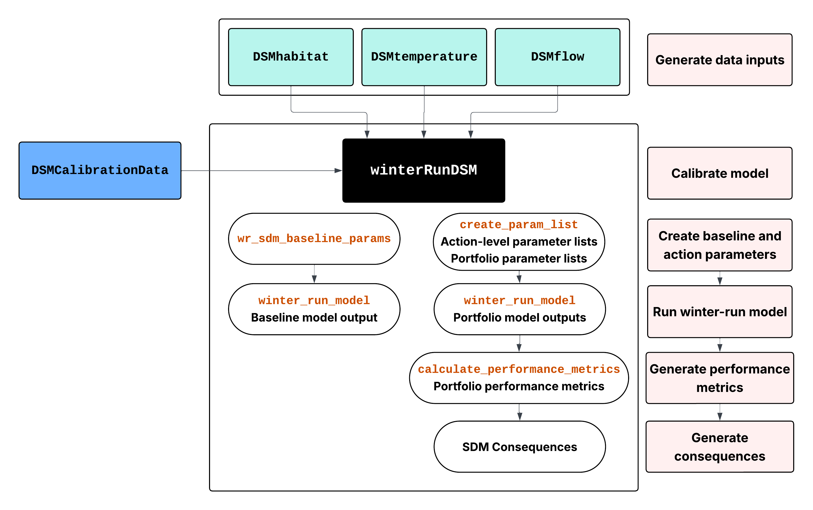

# Winter-Run Chinook Salmon Model for 2026 Winter-Run Structured Decision Making Effort 

This model was forked from the [Reorienting to Recovery](https://github.com/Reorienting-to-Recovery/winterRunDSM) model, which is based off the [CVPIA Science Integration Team Model](https://github.com/CVPIA-OSC/winterRunDSM) model.
The model has undergone several iterations targeted to specific processes, and the codebase reflects this. Comments 
are included throughout the codebase identifying where changes were made for the 2026 Winter Run SDM. 

## Original Authors:                                                     
                                                                     
James T. Peterson                                                    
U.S. Geological Survey, Oregon Cooperative Fish and Wildlife         
Research Unit, Oregon State University                               
Corvallis, Oregon 97331-3803, <jt.peterson@oregonstate.edu>            
                                                                     
Adam Duarte  
USDA Forest Service, Pacific Northwest Research Station  
Olympia, Washington 98512  
[adam.duarte\@usda.gov](mailto:adam.duarte@usda.gov)

See [Peterson and Duarte 2020](https://doi.org/10.1111/rec.13244) for information about original model development.

## Disclaimer:
Although this code has been processed successfully on a computer system at the U.S. Geological Survey (USGS), no warranty expressed or implied is made regarding the display or utility of the code for other purposes, nor on all computer systems, nor shall the act of distribution constitute any such warranty. The USGS or the U.S. Government shall not be held liable for improper or incorrect use of the  code  described and/or contained herein.

## License
[CC BY-NC-SA 4.0](https://creativecommons.org/licenses/by-nc-sa/4.0/)

IP-117068

## Usage

### Package Installation
The `winterRunDSM` package depends on a number of packages developed by the [CVPIA Open Science Collaborative](https://github.com/CVPIA-OSC). 
Modifications have been made to the packages. For the 2026 Winter Run SDM, install `winterRunDSM` and additional packages using the `remotes::install_github()` function. 

```r
# install.packages("remotes")
remotes::install_github("WinterRunSDM/winterRunDSM")

# optional - need if calibrating model
remotes::install_github("CVPIA-OSC/DSMCalibrationData")

# optional - need if wanting to explore or modify flow, habitat, and temperature inputs
remotes::install_github("WinterRunSDM/DSMflow")
remotes::install_github("WinterRunSDM/DSMhabitat")
remotes::install_github("WinterRunSDM/DSMtemperature")
```

### Run Model

The `winter_run_model()` is a Winter Run Chinook life cycle model originally used for [CVPIA's Structured Decision Making Process](http://cvpia.scienceintegrationteam.com/).
Running the model simulates Winter Run Chinook population dynamics across 31 watersheds in California over a 20 year period. 

The following code shows how to run the model for baseline conditions and for a scenario composed of actions 
defined in the Winter Run SDM:

```r

# baseline run
# seed model
baseline_seeds <- winterRunDSM::winter_run_model(mode = "seed",
                                              seeds = NULL, 
                                              ..params = winterRunDSM::wr_sdm_baseline_params)

# baseline results 
baseline_results <- winterRunDSM::winter_run_model(mode = "simulate", 
                                                   ..params = winterRunDSM::wr_sdm_scenario_params,
                                                    seeds = baseline_seeds)
                                                    
# run model for scenario composed of actions (here the Battle Creek Actions)
alt_params <- create_param_list(action_ids = c("BC-1", "BC-2", "BC-3", "BC-5", "BC-6", "BC-7", "BC-8", "BC-9"))

# seed model
alt_seeds <- winterRunDSM::winter_run_model(mode = "seed",
                                              seeds = NULL, 
                                              ..params = alt_params)

# evaluate the impact of your scenario over the 20 year simulation
wr_sdm_model_results <- winterRunDSM::winter_run_model(mode = "simulate", 
                                                       alt_params,
                                                       seeds = alt_seeds)
```

## Details on Supporting Data

### Dependencies
The `winterRunDSM` package uses data from several other packages within the [CVPIA Open Science Collaborative](https://github.com/WinterRunSDM). These relationships are visualized below. 



### Flow, Habitat, and Temperature Data

All data used in the `winterRunDSM` is passed in as a argument to `winter_run_model()` from a `winterRunDSM::wr_sdm_baseline_params` data list that is composed of data objects from the following packages:

* **Flow Data**: View detailed documentation of flow data inputs at [DSMflow](https://winterRunSDM.github.io/DSMflow/). Flow inputs to the `winterRunDSM` are generated using CalSim 3 data.
* **Habitat Data**: View detailed documentation of habitat data inputs at [DSMhabitat](https://winterRunSDM.github.io/DSMhabitat/). Modeling details for each stream can be viewed [here](https://cvpia-osc.github.io/DSMhabitat/reference/habitat_data.html#modeling-details-for-streams).
* **Temperature Data**: View detailed documentation of temperature data inputs at [DSMtemperature](https://winterRunSDM.github.io/DSMtemperature/). Modeling details for each stream can be viewed [here](https://cvpia-osc.github.io/DSMtemperature/reference/stream_temperature.html#watershed-modeling-details).

### Calibration Data

Datasets for calibration exist in the `DSMCalibration` package for model calibration. 
These inputs were used :

1. [GrandTab](https://wildlife.ca.gov/Conservation/Fishes/Chinook-Salmon/Anadromous-Assessment) estimated escapement data for the years 1998-2017. The GrandTab data is prepared as `DSMCalibrationData::grandtab_observed` and is used to measure the difference between model predictions and observed escapements. Grandtab data is additionally prepared as `DSMCalibrationData::grandtab_imputed` and is used to calculate the number of juveniles during the 20 year simulation.

2. Proxy years are used to select Habitat, Flow, and Temperature data for 1998-2017 to correspond with the years of GrandTab escapement data. The data inputs to the DSM are for years 1980-1999. We selected proxy years for 1998-2017 from the 1980-1999 model inputs by [comparing the DWR water year indices](https://cdec.water.ca.gov/reportapp/javareports?name=WSIHIST).

For a detailed overview of the calibration process see the [calibration markdown.](https://cvpia-osc.github.io/winterRunDSM/articles/calibration-2021.html)

### Folder Structure

Code for generating outputs at different stages are described below:

* Creating parameter lists as inputs into the winter-run model
  - **Cached static inputs:** `data-raw/cache-data.R`
  - **Baseline:** `wr_sdm/wr_sdm_baseline_parameters.R`
  - **Actions:** `R/create_parameter_list_function.R`
  
* Running winter-run model
  - **Model Code:** `R/model.R`
    - **Submodels:** Located in `R/`
  
* Creating portfolios
  - **Create parameter lists and model results for all portfolios:** `wr_sdm/create_portfolios.R`
  - **Calculate performance metrics for all portfolios:** `wr_sdm/portfolios/calculate_portfolio_performance_metrics.R`
    - **Calculate habitat proportion in watersheds:** `wr_sdm/portfolios/calculate_habitat_prop_portfolios.R`
  - **Generate performance metrics for all portfolios:** `wr_sdm/portfolios/explore_portfolios.R`
  
* Consequences
  - **Create consequence tables and results tables:** `wr_sdm/consequence_tables/create_consequence_tables.R`
    - **Weight sets:** `wr_sdm/consequence_tables/weights.xlsx`
    - **Consequence table best and worst:** `wr_sdm/consequence_tables/ct_scales.csv`
    - **Non-modeled metrics scores, lookups:** 
      - `wr_sdm/consequence_tables/nonmodeled_metrics.csv`
      - `wr_sdm/consequence_tables/nonmodeled_metrics_lookup.csv`
      - `wr_sdm/consequence_tables/timeliness_norm.csv`
      
### Shiny App

Visualize model inputs, outputs, consequences, and weighted results on the Shiny App at: [WR Shiny App](https://flowwest.shinyapps.io/winterRunDSM-shiny/)