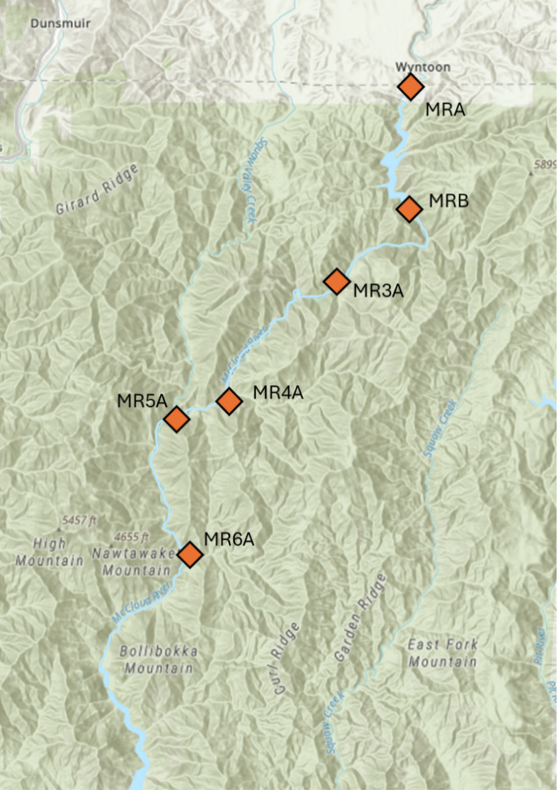
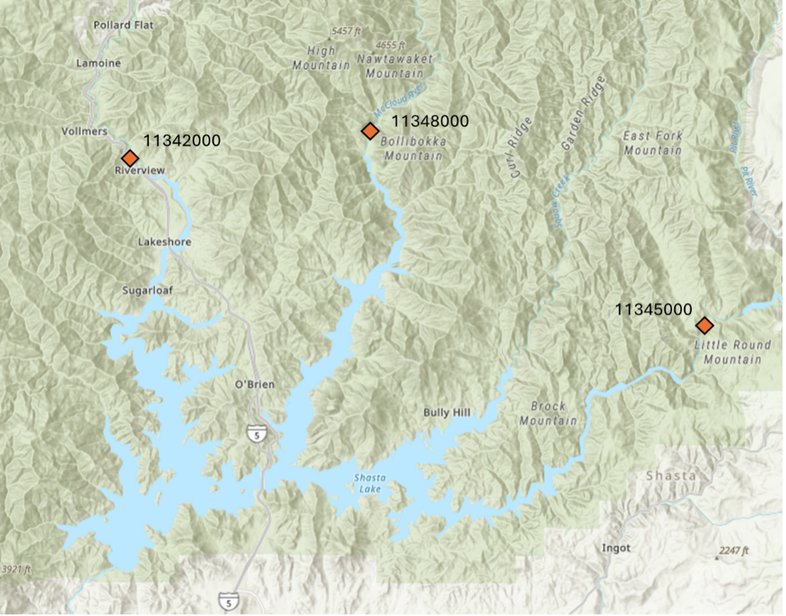

```{r, include = FALSE}
library(tidyverse)
library(DSMhabitat)
library(winterRunDSM)
library(knitr)
library(readxl)
library(here)
knitr::opts_chunk$set(
  collapse = TRUE,
  comment = "#>"
)
our_palette <- viridis::turbo(6)
```

# Egg-to-fry Surival in the WR SDM process

The SIT and SIT-derivative lifecycle models egg-to-fry submodel does not account for the effect of modeled temperatures on egg-to-fry survival. For WRCS and in the Winter Run SDM process this was identified as a limiting factor for understanding the benefits of multiple actions designed to improve temperature conditions for the spawning and egg incubation lifestages. 

## Overview of baseline egg-to-fry submodel

The baseline egg-to-fry submodel calculates the probability that a salmon egg survives to become a fry. It returns a single survival rate per watershed that is then used to convert the number of eggs laid into fry in a spawn success submodel.

**Inputs**

- `proportion_natural`: the proportion of spawners that are of natural origin (vs hatchery) for each watershed — this varies by year as the hatchery/natural composition of the spawning population changes
- `scour`: the probability of a redd scouring event for each watershed — this is a fixed parameter from `prob_nest_scoured` and does not vary by year
- `.surv_egg_to_fry_int`: intercept — fixed calibrated parameter
- `.proportion_natural`: coefficient on `proportion_natural` — fixed
- `.scour`: coefficient on `scour` — fixed
- `..surv_egg_to_fry_mean_egg_temp_effect`: a multiplier applied after the inverse logit — fixed calibrated parameter

**The model**

```r
boot::inv.logit(.surv_egg_to_fry_int + 
                .proportion_natural * proportion_natural +
                .scour * scour) * ..surv_egg_to_fry_mean_egg_temp_effect
```

The model is an inverse logit function, constraining the output to a avlue between 0 and 1 representing egg-to-fry survival. That probability is then scaled by `..surv_egg_to_fry_mean_egg_temp_effect` which represents the average effect of egg incubation temperature on survival.

**Temperature Effect**

Temperature-dependent mortality (TDM) is a significant source of mortality in the egg-to-fry lifestage. This effect for the Winter-Run lifecycle model is calibrated, wherease for the fall- and spring-run SIT-derivative models it is averaged across multiple wet and dry years. The calibrated value for this `0.943`, which indicated a small scaling effect of survival due to temperature effects (`<10%`). However, this is dependent on calibration and is influenced by many factors in the model calibration process.

**Year to year variation**

The only input that causes egg-to-fry survival to from year to year is `proportion_natural`. Egg-to-fry survival will be higher in years where more natural-origin fish are spawning (because natural fish have better egg-to-fry survival than hatchery fish), and lower in years with more hatchery-origin spawners. All other inputs are fixed parameters, so the only source of interannual variation is the changing hatchery/natural composition of the spawning population.


## Adapting the model for actions in the WR SDM process

Several actions proposed for WRCS involve providing access to better temperatures:

* ASD-5
* ASD-6
* ASD-7

Specifically, any action that proposed new habitat above Shasta Dam came with an assumption that egg-to-fry survival might be positively affected due to access to more suitable (i.e. colder) temperatures during the spawning and egg incubation lifestages. 

One key limitation of modeling effects on egg-to-fry survival due to temperatures was that the baseline submodel does not have an input that is directly calculated from, or interacts with, modeled temperatures. Because there is no way to directly plug in temperature values, the modeling team needed to develop a different approach.

Several participants highlighted the importance of applying the same temperature threshold (`53.5 F`) above which egg mortality accrues. Modifying the baseline temperature model is a major change to the model, one which requires careful QA/QC, sensitivity analyses, and documentation. In the time frame available, this was ruled out. However, the modeling team developed a different approach that still relied on data and a consistent threshold for any actions where new habitat was introduced and an egg-to-fry survival benefit was to be modeled.

## Interim Approach

**Data:** Temperature time series provided by Mike Deas and Maya Wood, Watercourse Engineering Inc. Contains time series from sources along Battle Creek, Shasta Lake, the McCloud River, Sacramento River, and Pit River. These data were also used to scale total proposed habitat to account for temperature suitability.

**Approach:** Take temperature timeseries from representative locations and calculate the proportion of days from May-August (spawning) where the temperature is below `53.5 F`. Calculate how this proportion relates to data from below Keswick and use that ratio to modify the component of the egg-to-fry submodel that models the effect of temperature, effectively scaling the egg-to-fry survival by the suitable temperatures for the proposed action.

### Metadata

The gages and their metadata and relevant maps are presented below, from the Watercourse Engineering report. 

```{r, echo = FALSE, warning = FALSE, message = FALSE}
md_metadata <- read_xlsx(here("data-raw", "habitat-data-docs", "mike_deas_data.xlsx"),
                         sheet = "metadata")
md_data <- read_xlsx(here("data-raw", "habitat-data-docs", "mike_deas_data.xlsx"),
                     sheet = "data")
temps <- read_csv(here("data-raw", "habitat-data-docs", "mikedeas_Temp_data_clean.csv")) |> 
  #filter(statistic == "avg") |> 
  mutate(date = as.Date(date))
```

```{r, echo = FALSE, warning = FALSE, message = FALSE}
knitr::kable(md_metadata)
```

Additionally, for below Keswick temperatures representing baseline, we use the USGS gage below Keswick, `KWK` on CDEC. 

```{r, echo = FALSE, warning = FALSE, message = FALSE}
library(CDECRetrieve)
kwk <- CDECRetrieve::cdec_query(station = "KWK", dur_code = "H", sensor_num = "25", start_date = "2000-10-01")
```

```{r, echo = FALSE, warning = FALSE, message = FALSE}
kwk_clean <- kwk |> 
  mutate(date = as.Date(datetime)) |> 
  group_by(date) |> 
  summarise(mean_daily_temp = mean(parameter_value, na.rm = T)) |> 
  ungroup() |> 
  filter(month(date) %in% 5:8) |> 
  mutate(month = month(date),
         below_threshold = ifelse(mean_daily_temp <= 53.5, TRUE, FALSE)) |> 
  filter(!is.na(month), !is.na(mean_daily_temp)) 

kwk_clean |> 
  ggplot(aes(x = date, y = mean_daily_temp)) +
  geom_line() + 
  geom_hline(aes(yintercept = 53.5), linetype = "dashed") +
  scale_x_date(date_labels = "%Y", date_breaks = "1 year") +
  annotate("text", x = min(kwk_clean$date), y = 54.5, label = "53.5°F",
           hjust = 0, size = 3, color = "gray30") +
  labs(x = "Date", y = "Temperature (F)",
       title = "KWK Spawning Time Series")

kwk_clean |> 
  group_by(month) |> 
  summarise(prop_below_threshold = round(sum(below_threshold)/n(), 2)) |> 
  ungroup() |> 
  knitr::kable()
```

The average proportion of days within the months of May-August that are below `53.5 F` below Keswick across years 2000-present is `0.85`. 

### McCloud River



#### Lower McCloud River (ASD-5 & ASD-6)

We used `MR4A` as the relevant gage for representing spawning habitat in the Lower McCloud River. The value by which to scale the total egg-to-fry survival is `(0.28 - 0.85) / 0.85 = -0.67`. 

```{r, echo = FALSE, warning = FALSE, message = FALSE}
mr4a <- temps |> 
  filter(location == "MR4A",
         statistic == "avg",
         month(date) %in% 5:8)

mr4a |>
  ggplot(aes(x = date, y = deg_f)) + 
  geom_line() +
  theme_minimal() + 
  geom_hline(aes(yintercept = 53.5), linetype = "dashed") +
  scale_x_date(date_labels = "%b %Y", date_breaks = "1 month") +
  annotate("text", x = min(mr4a$date), y = 54.5, label = "53.5°F",
           hjust = 0, size = 3, color = "gray30") +
  labs(x = "Date", y = "Temperature (F)",
       title = "MR4A Spawning Time Series")

mr4a |> 
  mutate(below_threshold = ifelse(deg_f <= 53.5, TRUE, FALSE)) |> 
  group_by(year(date)) |> 
  summarise(prop_below_threshold = round(sum(below_threshold, na.rm = T) / n(), 2)) |> 
  ungroup() |> 
    select(year = `year(date)`,
           prop_below_threshold) |> 
  knitr::kable()
```


#### Full McCloud River 

We took the average of the value for `MR4A` (`0.28`) for the Lower McCloud and the value for the station `MRA` (`0.99`) representing the Upper McCloud resulting in a mean proportion of `0.625`. 

```{r, echo = FALSE, warning = FALSE, message = FALSE}
mra <- temps |> 
  filter(location == "MRA",
         statistic == "avg",
         month(date) %in% 5:8)

mra |>
  ggplot(aes(x = date, y = deg_f)) + 
  geom_line() +
  theme_minimal() + 
  geom_hline(aes(yintercept = 53.5), linetype = "dashed") +
  scale_x_date(date_labels = "%b %Y", date_breaks = "1 month") +
  annotate("text", x = min(mra$date), y = 54.5, label = "53.5°F",
           hjust = 0, size = 3, color = "gray30") +
  labs(x = "Date", y = "Temperature (F)",
       title = "MRA Spawning Time Series")

mra |> 
  mutate(below_threshold = ifelse(deg_f <= 53.5, TRUE, FALSE)) |> 
  group_by(year(date)) |> 
  summarise(prop_below_threshold = round(sum(below_threshold, na.rm = T) / n(), 2)) |> 
  ungroup() |> 
    select(year = `year(date)`,
           prop_below_threshold) |> 
  knitr::kable()
```

The value by which to scale the total egg-to-fry survival is `(0.625 - 0.85) / 0.85 = -0.26`. 

### Little Upper Sacramento River (ASD-5 & ASD-6)



We used `11342000` as the relevant gage for representing spawning habitat in the Little Upper Sacramento River. The value by which to scale the total egg-to-fry survival is `(0.17 - 0.85) / 0.85 = -0.80`. 

```{r, echo = FALSE, warning = FALSE, message = FALSE}
lilsac <- temps |> 
  filter(location == "sacasl",
         statistic == "avg",
         month(date) %in% 5:8)

lilsac |>
  ggplot(aes(x = date, y = deg_f)) + 
  geom_line() +
  theme_minimal() + 
  geom_hline(aes(yintercept = 53.5), linetype = "dashed") +
  scale_x_date(date_labels = "%b %Y", date_breaks = "1 month") +
  annotate("text", x = min(lilsac$date), y = 54.5, label = "53.5°F",
           hjust = 0, size = 3, color = "gray30") +
  labs(x = "Date", y = "Temperature (F)",
       title = "11342000 Spawning Time Series")

lilsac |> 
  mutate(below_threshold = ifelse(deg_f <= 53.5, TRUE, FALSE)) |> 
  group_by(year(date)) |> 
  summarise(prop_below_threshold = round(sum(below_threshold, na.rm = T) / n(), 2)) |> 
  ungroup() |> 
    select(year = `year(date)`,
           prop_below_threshold) |> 
  knitr::kable()
```

# Results

```{r, echo = FALSE, warning = FALSE, message = FALSE}
# this code is also in cache-data.R so we can read it into our param function
wr_sdm_egg_to_fry_values <- tibble("Station ID" = c("11342000", "MRA", "MR4A", NA_character_),
                          "Watershed" = c("Little Sacramento River", "Upper McCloud River", "Lower McCloud River", "Full McCloud River"),
                          "Egg-to-Fry Scale Factor" = c(-0.80, 1.17, -0.67, -0.26))

wr_sdm_egg_to_fry_values |> 
  knitr::kable()
```