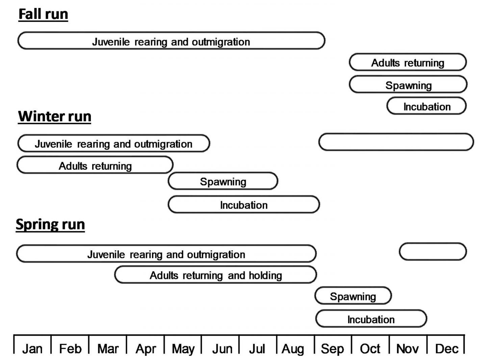
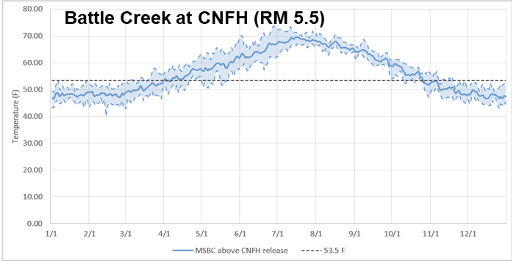
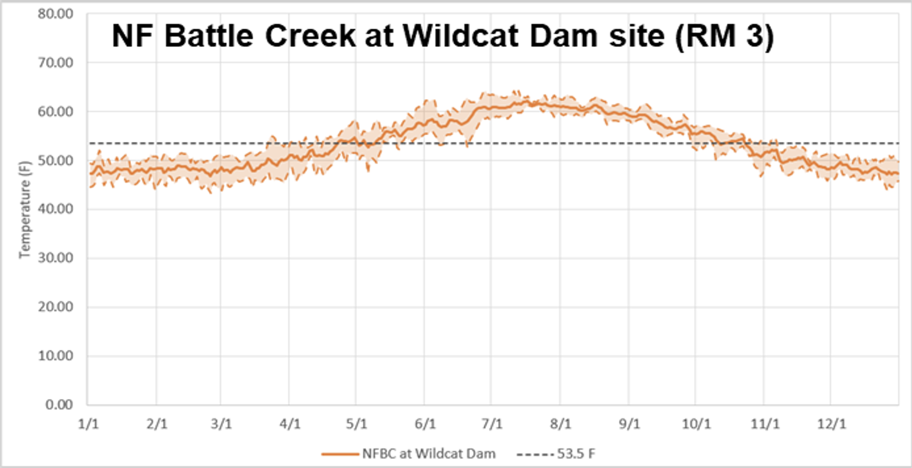
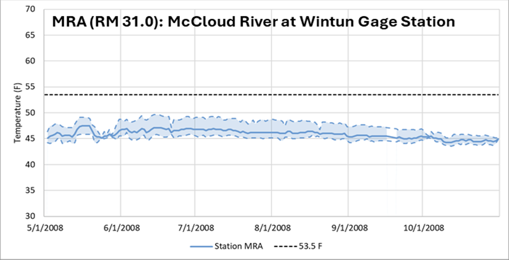
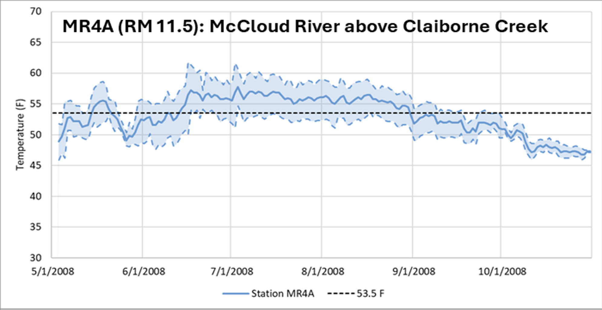
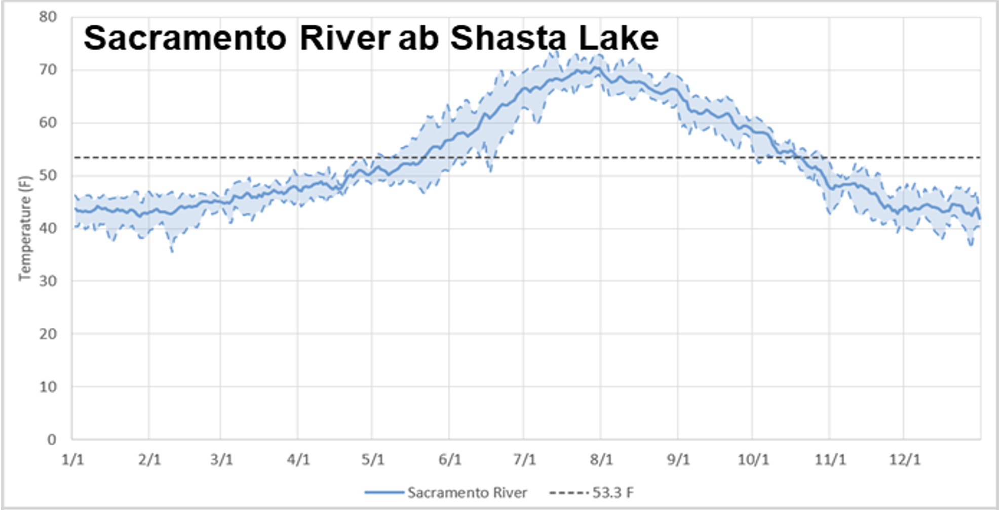

```{r, include = FALSE}
library(tidyverse)
library(DSMhabitat)
library(winterRunDSM)
library(knitr)
library(readxl)
library(here)
knitr::opts_chunk$set(
  collapse = TRUE,
  comment = "#>"
)
our_palette <- viridis::turbo(6)
```

# Habitat Action Documentation

## Battle Creek

Additional habitat was required for two Battle Creek actions: `BC-2` and `BC-5`. 

### A note on baseline habitat

The baseline Battle Creek habitat for WRCS took WUA data from a 1995 study that was averaged across all habitat (Lower Battle Creek and the North Fork), and then scaled it to the river lengths. In the original SIT, the river lengths applied for WRCS were Lower Battle Creek and North Fork, whereas for fall run the river lengths were restricted to Lower Battle Creek. We updated the baseline for WRCS to be applied to the same river lengths as fall run, representing anecdotal and scientific support for little spawning and rearing habitat for WRCS above the confluence owing to a natural barrier below Eagle Canyon Diversion Dam. 

```{r, echo = FALSE, warning = FALSE, message = FALSE}
old_hab <- read_csv(here("data-raw", "habitat-data-docs", "wr_habitat_baseline_action5_2026-03-24.csv"))

new_hab <- DSMhabitat::wr_spawn$action_5["Battle Creek",,] |> 
  as.data.frame() |> 
  mutate(month = 1:12) |> 
  pivot_longer(`1979`:`2000`,
               names_to = "year",
               values_to = "habitat_sqm") |> 
  mutate(lifestage = "spawn") |> 
  bind_rows(DSMhabitat::wr_juv$action_5["Battle Creek",,] |> 
            as.data.frame() |> 
            mutate(month = 1:12) |> 
            pivot_longer(`1980`:`2000`,
                         names_to = "year",
                         values_to = "habitat_sqm") |> 
            mutate(lifestage = "juv")) |> 
    bind_rows(DSMhabitat::wr_fry$action_5["Battle Creek",,] |> 
            as.data.frame() |> 
            mutate(month = 1:12) |> 
            pivot_longer(`1980`:`2000`,
                         names_to = "year",
                         values_to = "habitat_sqm") |> 
            mutate(lifestage = "fry")) |> 
    bind_rows(DSMhabitat::wr_fp$action_5["Battle Creek",,] |> 
            as.data.frame() |> 
            mutate(month = 1:12) |> 
            pivot_longer(`1980`:`2000`,
                         names_to = "year",
                         values_to = "habitat_sqm") |> 
            mutate(lifestage = "fp")) |> 
  mutate(year = as.integer(year),
         scenario = "baseline_action5_2026-03-24",
         run = "winter")

old_hab |> 
  bind_rows(new_hab) |> 
  mutate(habitat_acres = DSMhabitat::square_meters_to_acres(habitat_sqm),
         fake_date = as.Date(paste0(year, "-", month, "-01"))) |> 
  ggplot(aes(x = fake_date, y = habitat_acres, color = scenario)) + 
  geom_line() +
  facet_wrap(~lifestage, nrow = 4, scales = "free_y") +
  theme_minimal() +
  theme(legend.position = "bottom") +
  labs(x = "Simulation Date",
       y = "Habitat (acres)",
       title = "Baseline habitat update for Battle Creek",
       subtitle = "Constrained to Lower Battle Creek") +
  scale_color_manual(values = our_palette)
  

```

### BC-2: Lower Battle Creek rearing habitat

This action modeled the inclusion of several habitat projects designed to increase rearing habitat in Lower Battle Creek. Acreage from proposed projects provided to FlowWest was added to existing habitat across all flows for instream spawning and rearing, and scaled down to 25% of total project areas based on project proponents knowledge of project designs ability to provide suitable habitat at different flows. Suitable habitat areas were added to the flow-to-habitat curves in DSMhabitat (habitat inputs for the model) at a representative flow. The percent increase in habitat at a representative flow was then applied across all flows.

```{r, echo = FALSE, warning = FALSE, message = FALSE}
bc_proj <- read_xlsx(here("data-raw", "habitat-data-docs", "DRAFT Battle Creek Projects List 0721(1).xlsx"), skip = 1) |> 
  janitor::clean_names()

bc2_projects_fp <- c("CDFW Tompkins Unit Phase II", 
                    "Rancho Breisgau Habitat Restoration Phase 1 Field 1",
                    "Rancho Briesgau Habitat Restoration Phase 2, Fields 2-4", 
                    "Rancho Breisgau Floodplain Expansion",
                    "McBartlett Restoration", 
                    "Jelly's Ferry Mitigation at Rancho Breisgau",
                    "Battle Creek Levee", 
                    "Battle Creek Wildlife Area")
bc2_projects_ic <- c("Battle Creek Wildlife Area",
                     "Battle Creek Levee")

modeled_hab_clean <- tibble("project" = bc2_projects_fp,
                            "modeled_fp" = c(15, 32.5, 39, 22.5, 11.25, 4.8, 6.75, 1.25),
                            "modeled_ic" = c(rep(0, 6), 1.7, 1.3))

bc_proj |> 
  filter(project %in% c(bc2_projects_fp)) |> 
  select(project, rearing_habitat_ac, floodplain_habitat_ac) |> 
  left_join(modeled_hab_clean, by = "project") |> 
  mutate(logic = c(rep("Instream suitable across all flows; Floodplain scaled down by 0.25", 2),
                   rep("Floodplain scaled down by 0.25", 5))
         ) |> 
  select(Project = project, "Additional instream habitat (acres)" = modeled_ic,
         "Additional floodplain habitat (acres)" = modeled_fp, "Logic" = logic) |> 
  knitr::kable()
```

The median flow used to apply the additional habitat, and then scale, to the flow-to-habitat curve for Battle Creek was `550 cfs`, the median flow across a subset of rearing months (Jan-May).

**Technical notes** 

The overall implementation of floodplain and inchannel rearing is different.

Floodplain: adds to the `battle_creek_floodplain` data object by inserting a new row of `112 acres` at `550 cfs`. The reason we did this was because we wanted the floodplain to be activated at a lower flow. Prior activation occurred at `1325 cfs`.

Inchannel: this used the same methodology at TMH and baseline habitat for R2R where we found a representative acreage for a given flow and scaled the DSMhabitat object accordingly. The only difference in methodology is that we used the WUA median flow of `66 cfs` instead of battle creek DSMflow median flow because those flows were outside the range of the existing WUAs.

Documentation lives in `data-raw/battle-creek-habitat` on `DSMhabitat`.

### BC-5: Battle Creek North Fork spawning and in-channel habitat

This involved extracting the WUA from the 1995 report for combined mainstem and north fork of Battle Creek (p. C-1), and scaling it to the full reach. Baseline habitat only extends ~4 miles of spawning and ~6 miles of rearing of the full 18 miles.

### BC-2 and BC-5

For habitat actions that include both BC-2 (Lower Battle Creek) and BC-5 (North Fork), the estimated additional habitat for each action (on top of baseline) was summed and then added to baseline.

```{r, echo = FALSE, warning = FALSE, message = FALSE}
compare_all_bc <- DSMhabitat::wr_spawn$action_5["Battle Creek",,] |> 
  as.data.frame() |> 
  mutate(month = 1:12) |> 
  pivot_longer(`1979`:`2000`, 
               names_to = "year",
               values_to = "habitat_sqm") |> 
  mutate(scenario = "baseline",
         lifestage = "spawn") |> 
  bind_rows(DSMhabitat::wr_spawn$action_5_bc_2["Battle Creek",,] |> 
  as.data.frame() |> 
  mutate(month = 1:12) |> 
  pivot_longer(`1979`:`2000`, 
               names_to = "year",
               values_to = "habitat_sqm") |> 
  mutate(scenario = "bc-2",
         lifestage = "spawn")) |> 
  bind_rows(DSMhabitat::wr_spawn$action_5_bc_5["Battle Creek",,] |> 
  as.data.frame() |> 
  mutate(month = 1:12) |> 
  pivot_longer(`1979`:`2000`, 
               names_to = "year",
               values_to = "habitat_sqm") |> 
  mutate(scenario = "bc-5",
         lifestage = "spawn")) |> 
    bind_rows(DSMhabitat::wr_spawn$action_5_bc_2_bc_5["Battle Creek",,] |> 
  as.data.frame() |> 
  mutate(month = 1:12) |> 
  pivot_longer(`1979`:`2000`, 
               names_to = "year",
               values_to = "habitat_sqm") |> 
  mutate(scenario = "bc-2 + bc-5",
         lifestage = "spawn")) |> 
  # juvenile
  bind_rows(DSMhabitat::wr_juv$action_5["Battle Creek",,] |> 
  as.data.frame() |> 
  mutate(month = 1:12) |> 
  pivot_longer(`1980`:`2000`, 
               names_to = "year",
               values_to = "habitat_sqm") |> 
  mutate(scenario = "baseline",
         lifestage = "juv")) |> 
  bind_rows(DSMhabitat::wr_juv$action_5_bc_2["Battle Creek",,] |> 
  as.data.frame() |> 
  mutate(month = 1:12) |> 
  pivot_longer(`1980`:`2000`, 
               names_to = "year",
               values_to = "habitat_sqm") |> 
  mutate(scenario = "bc-2",
         lifestage = "juv")) |> 
    bind_rows(DSMhabitat::wr_juv$action_5_bc_5["Battle Creek",,] |> 
  as.data.frame() |> 
  mutate(month = 1:12) |> 
  pivot_longer(`1980`:`2000`, 
               names_to = "year",
               values_to = "habitat_sqm") |> 
  mutate(scenario = "bc-5",
         lifestage = "juv")) |> 
    bind_rows(DSMhabitat::wr_juv$action_5_bc_2_bc_5["Battle Creek",,] |> 
  as.data.frame() |> 
  mutate(month = 1:12) |> 
  pivot_longer(`1980`:`2000`, 
               names_to = "year",
               values_to = "habitat_sqm") |> 
  mutate(scenario = "bc-2 + bc-5",
         lifestage = "juv")) |> 
  # fry
    bind_rows(DSMhabitat::wr_fry$action_5["Battle Creek",,] |> 
  as.data.frame() |> 
  mutate(month = 1:12) |> 
  pivot_longer(`1980`:`2000`, 
               names_to = "year",
               values_to = "habitat_sqm") |> 
  mutate(scenario = "baseline",
         lifestage = "fry")) |> 
  bind_rows(DSMhabitat::wr_fry$action_5_bc_2["Battle Creek",,] |> 
  as.data.frame() |> 
  mutate(month = 1:12) |> 
  pivot_longer(`1980`:`2000`, 
               names_to = "year",
               values_to = "habitat_sqm") |> 
  mutate(scenario = "bc-2",
         lifestage = "fry")) |> 
    bind_rows(DSMhabitat::wr_fry$action_5_bc_5["Battle Creek",,] |> 
  as.data.frame() |> 
  mutate(month = 1:12) |> 
  pivot_longer(`1980`:`2000`, 
               names_to = "year",
               values_to = "habitat_sqm") |> 
  mutate(scenario = "bc-5",
         lifestage = "fry")) |> 
  bind_rows(DSMhabitat::wr_fry$action_5_bc_2_bc_5["Battle Creek",,] |> 
  as.data.frame() |> 
  mutate(month = 1:12) |> 
  pivot_longer(`1980`:`2000`, 
               names_to = "year",
               values_to = "habitat_sqm") |> 
  mutate(scenario = "bc-2 + bc-5",
         lifestage = "fry")) |> 
  # floodplain
  bind_rows(DSMhabitat::wr_fp$action_5["Battle Creek",,] |> 
  as.data.frame() |> 
  mutate(month = 1:12) |> 
  pivot_longer(`1980`:`2000`, 
               names_to = "year",
               values_to = "habitat_sqm") |> 
  mutate(scenario = "baseline",
         lifestage = "floodplain")) |> 
  bind_rows(DSMhabitat::wr_fp$action_5_bc_2["Battle Creek",,] |> 
  as.data.frame() |> 
  mutate(month = 1:12) |> 
  pivot_longer(`1980`:`2000`, 
               names_to = "year",
               values_to = "habitat_sqm") |> 
  mutate(scenario = "bc-2",
         lifestage = "floodplain")) |> 
  mutate(fake_date = as.Date(paste0(year, "-", month, "-01")))
```

```{r, echo = FALSE, warning = FALSE, message = FALSE}
compare_all_bc |> 
  mutate(habitat_acres = DSMhabitat::square_meters_to_acres(habitat_sqm)) |> 
  ggplot(aes(x = fake_date, y = habitat_acres, color = scenario)) + 
  geom_line() +
  facet_wrap(~lifestage, scales = "free_y") +
  theme_minimal() +
  labs(x = "Simulation date",
       y = "Habitat (acres)",
       title = "Battle Creek habitat data by action") +
  theme(legend.position = "bottom") +
  scale_color_manual(values = our_palette)

```

## Sacramento River

## Above Shasta Dam

# Habitat scaling by temperature

## Temperature threshold data from Mike Deas

The modeling team requested and received a report from Mike Deas and Maya Wood, Watercourse Engineering, Inc. that included a summary of days per month where the mean daily temperature exceeded `53.5 F`. This value was informed by participants during SDM working sessions and represents the critical threshold above which temperature-dependent mortality accures for WRCS eggs. The full report is included and we present the tables in this markdown to show how they were used to scale proposed additional habitat for:

* McCloud River
* Upper Sacramento River above Shasta Dam
* Battle Creek

```{r, echo = FALSE, warning = FALSE, message = FALSE}
md_metadata <- read_xlsx(here("data-raw", "habitat-data-docs", "mike_deas_data.xlsx"),
                         sheet = "metadata")
md_data <- read_xlsx(here("data-raw", "habitat-data-docs", "mike_deas_data.xlsx"),
                     sheet = "data")
```

```{r, echo = FALSE, warning = FALSE, message = FALSE}
knitr::kable(md_metadata)
knitr::kable(md_data)
```

## Scaling approach

Population dynamics in the lifecyle model, a derivative of the SIT DSM developed by Peterson & Duarte 2020, is structured by month:


*Fig. 2 from Peterson & Duarte, 2020*

We used the months relevant for each lifestage to scale the appropriate temperature estimates:

* Spawning: May - August
* Rearing (inchannel and floodplain): September - April

**Spawning:** Per the analyses in the [2003 EIR for the Battle Creek Restoration Project](https://www.waterboards.ca.gov/waterrights/water_issues/programs/water_quality_cert/docs/battlecreek_salmon_ferc1121/draft_eir/appendix_m.pdf), egg survival is `100%` below `55 F` and drops below `80%` at temperatures of `58 F`. Therefore we used additional plots from the analysis to apply a sliding scale of temperature effect, as the binary above/below `53.5 F` would not account for the accruing effects on suitability.

**Rearing:** Through conversations with modelers we selected a threshold of `68 F` as appropriate for juvenile rearing. 

### BC-2: Lower Battle Creek


*Deas & Wood, 2026*

```{r, echo = FALSE, warning = FALSE, message = FALSE}
md_data |> 
  filter(Station == "Upper Battle Creek") |> 
  knitr::kable()
```

**Spawning:** Nearly all days in May-August are not only above `53.5 F` but are also at or around `60 F` (figure). We propose scaling total habitat to `25%` of the proposed value to account for mortality in June-August and partial survival in May.

**Rearing:** Only one month from Sep-May showed temperatures near `68 F` (September) so we propose scaling to `90%` of total habitat.

### BC-5: North Fork Battle Creek


*Deas & Wood, 2026*

```{r, echo = FALSE, warning = FALSE, message = FALSE}
md_data |> 
  filter(Station == "Wildcat Dam") |> 
  knitr::kable()
```

**Spawning:** Nearly all days in May-August are not only above `53.5 F` but are also at or around `60 F` (figure). We initially proposed scaling total habitat to `25%` of the proposed value to account for mortality in June-August and partial survival in May; however, Wildcat dam may not represent all the cold-water habitat in the North Fork of Battle Creek which is fed by coldwater springs and shade from a steep canyon section. We propose instead using a scaling factor of `50%` to account for upper reach temperature suitability not represented by Wildcat dam.

**Rearing:** All months from Sep-May showed temperatures below `68 F` (September) so we propose scaling total habitat to `100%` of the proposed value.

### ASD: Upper McCloud


*Deas & Wood, 2026*

```{r, echo = FALSE, warning = FALSE, message = FALSE}
md_data |> 
  filter(Station == "MRA") |> 
  knitr::kable()
```

**Spawning:** All days in May-August are below `53.5 F`. We propose scaling total habitat to `100%` of the proposed value.

**Rearing:** All months from Sep-May showed temperatures below `68 F` (September) so we propose scaling total habitat to `100%` of the proposed value.

### ASD: Lower McCloud

There were several gages on the McCloud River as part of the report from Deas & Wood. We selected the gage `MR4A` as representative of the middle of the Lower McCloud.


*Deas & Wood, 2026*

```{r, echo = FALSE, warning = FALSE, message = FALSE}
md_data |> 
  filter(Station == "MR4A") |> 
  knitr::kable()
```

**Spawning:** 7 days in May were above the `53.5 F` threshold, 20 in June, and all days in July and August. Across all spawning months, however, the temperatures did not exceed `60 F`, so we propose scaling by `70%` to represent partial mortality (survival is ~80% at 58 F) for this temperature range.

**Rearing:** All months from Sep-May showed temperatures below `68 F` (September) so we propose scaling total habitat to `100%` of the proposed value.

### ASD: Full McCloud River 

For the Full McCloud River (for ASD-7; removal of McCloud Dam), we propose taking the average of our scaling factors for the Lower and Upper McCloud:

**Spawning:** Average of `100%` (Upper) and `70%` (Lower) - propose `85%`.

**Rearing:** Average of `100%` (Upper) and `100%` (Lower)  - propose `100%`

### ASD: Little Sacramento River


*Deas & Wood, 2026*

```{r, echo = FALSE, warning = FALSE, message = FALSE}
md_data |> 
  filter(Station == "Sacramento River") |> 
  knitr::kable()
```

**Spawning:** 11 days in May were above the `53.5 F` threshold and all days in June, July, and August. Temperatures exceeded `60 F` for July, August, and September. We propose scaling by `15%` to represent partial mortality in May and signficant mortality / stress in July, August, and September.

**Rearing:** September shows some temperatures near `68 F` and all temperatures from October-May below `68 F` (September) so we propose scaling total habitat to `90%` of the proposed value.

### ASD: Pit River

The Pit River was eliminated from consideration due to feedback about barriers and temperature suitability.


## Results

### Scaling factors

```{r, echo = FALSE, warning = FALSE, message = FALSE}
# this code is also in cache-data.R so we can read it into our param function
wr_sdm_temp_habitat_scaling_factors <- tibble("Station ID" = c("11342000", "MRA", "MR4A", NA_character_, "1000", "2000"),
                          "Watershed" = c("Little Sacramento River", "Upper McCloud River", "Lower McCloud River", "Full McCloud River", "North Fork Battle Creek", "Lower Battle Creek"),
                          "Spawning Scale Factor" = c(0.15, 1, 0.7, 0.85, 0.5, 0.25),
                          "Rearing Scale Factor" = c(0.9, 1, 1, 1, 1, 0.90))

wr_sdm_temp_habitat_scaling_factors |> 
  knitr::kable()
```
