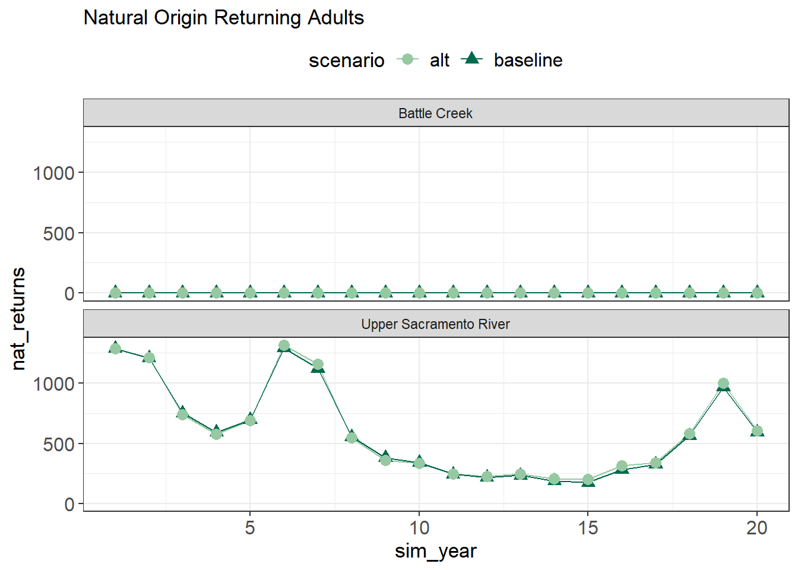
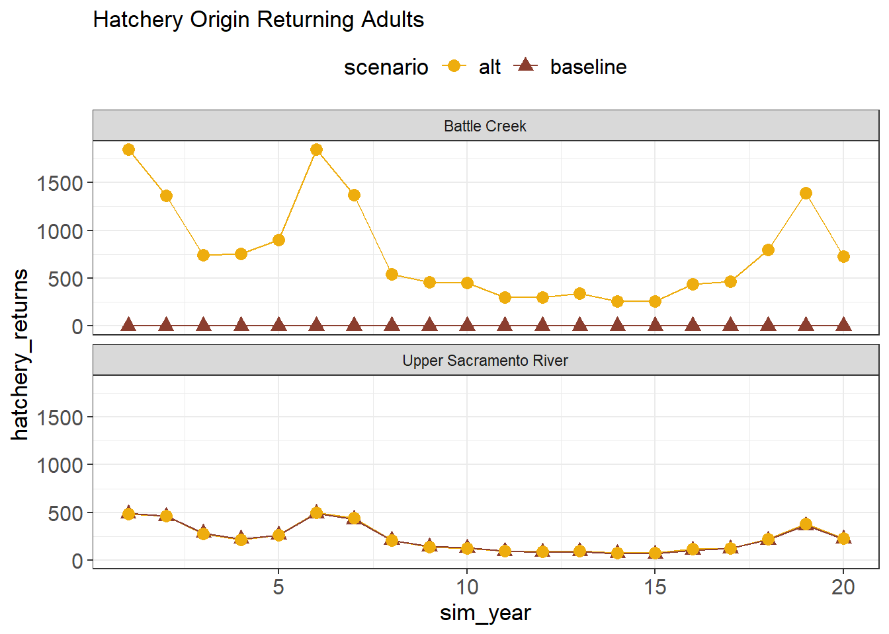
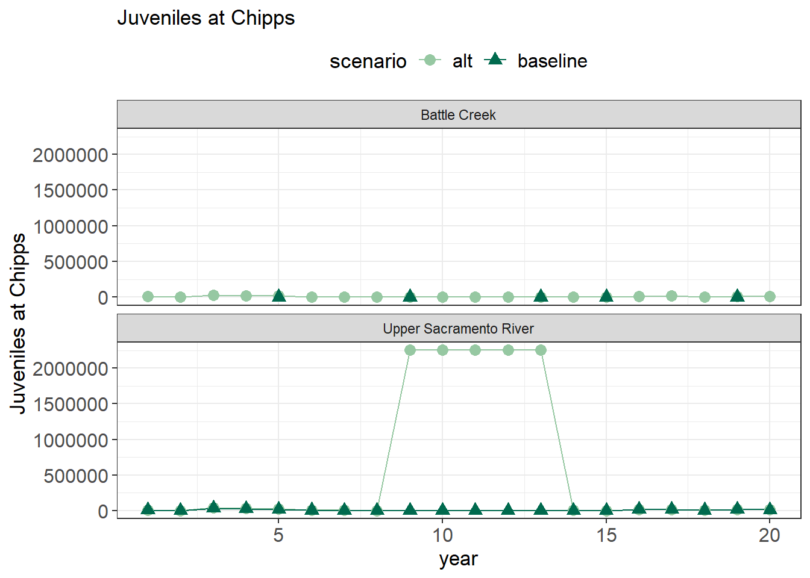
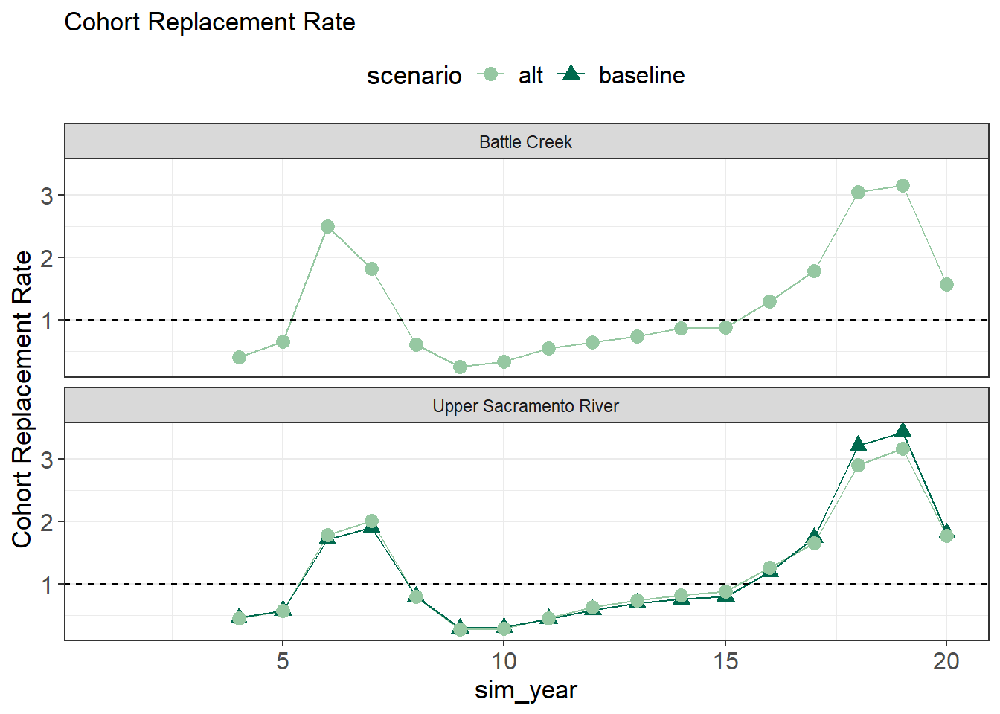
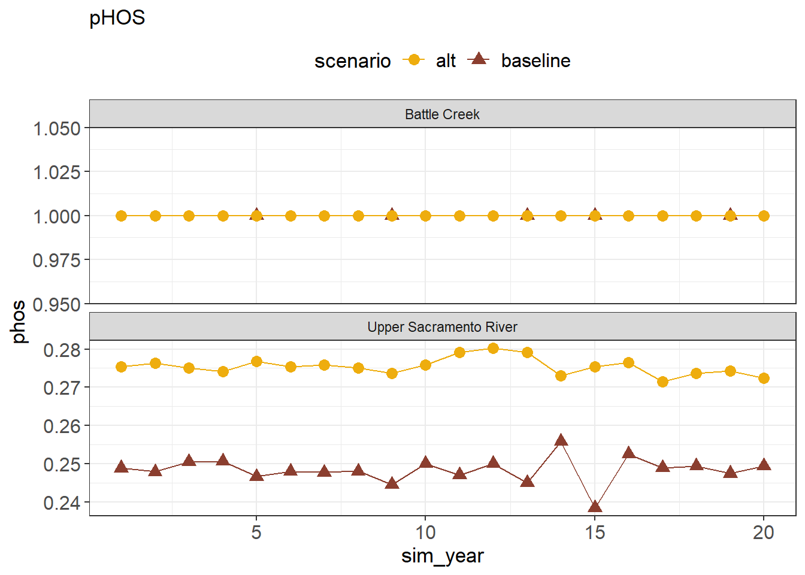
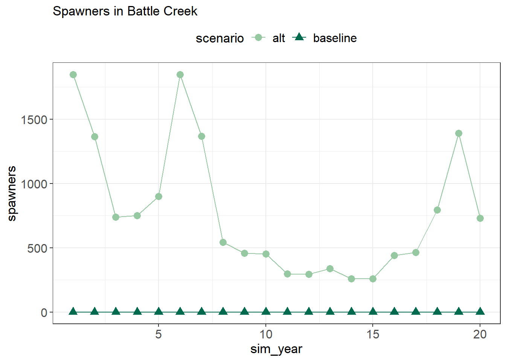

# Example Portfolio Model Results

## List changes made/brief description of alternatives included


::: {.cell}

:::


::: {.cell}

:::


## Abundance 

### Spawners

::: {.cell}
::: {.cell-output-display}

```{=html}
<div class="plotly html-widget html-fill-item" id="htmlwidget-dbe42fc4a02b72dbd2b4" style="width:100%;height:480px;"></div>
<script type="application/json" data-for="htmlwidget-dbe42fc4a02b72dbd2b4">{"x":{"data":[{"x":[1,2,3,4,5,6,7,8,9,10,11,12,13,14,15,16,17,18,19,20],"y":[1848,1366,738,752,900,1848,1368,544,458,454,298,296,338,260,260,440,464,794,1392,730],"text":["sim_year:  1<br />spawners: 1848<br />scenario: alt","sim_year:  2<br />spawners: 1366<br />scenario: alt","sim_year:  3<br />spawners:  738<br />scenario: alt","sim_year:  4<br />spawners:  752<br />scenario: alt","sim_year:  5<br />spawners:  900<br />scenario: alt","sim_year:  6<br />spawners: 1848<br />scenario: alt","sim_year:  7<br />spawners: 1368<br />scenario: alt","sim_year:  8<br />spawners:  544<br />scenario: alt","sim_year:  9<br />spawners:  458<br />scenario: alt","sim_year: 10<br />spawners:  454<br />scenario: alt","sim_year: 11<br />spawners:  298<br />scenario: alt","sim_year: 12<br />spawners:  296<br />scenario: alt","sim_year: 13<br />spawners:  338<br />scenario: alt","sim_year: 14<br />spawners:  260<br />scenario: alt","sim_year: 15<br />spawners:  260<br />scenario: alt","sim_year: 16<br />spawners:  440<br />scenario: alt","sim_year: 17<br />spawners:  464<br />scenario: alt","sim_year: 18<br />spawners:  794<br />scenario: alt","sim_year: 19<br />spawners: 1392<br />scenario: alt","sim_year: 20<br />spawners:  730<br />scenario: alt"],"type":"scatter","mode":"lines","line":{"width":1.8897637795275593,"color":"rgba(150,200,162,1)","dash":"solid"},"hoveron":"points","name":"(alt,1)","legendgroup":"(alt,1)","showlegend":true,"xaxis":"x","yaxis":"y","hoverinfo":"text","frame":null},{"x":[1,2,3,4,5,6,7,8,9,10,11,12,13,14,15,16,17,18,19,20],"y":[1772,1672,1018,794,954,1816,1602,756,496,464,344,314,344,284,276,434,470,804,1378,836],"text":["sim_year:  1<br />spawners: 1772<br />scenario: alt","sim_year:  2<br />spawners: 1672<br />scenario: alt","sim_year:  3<br />spawners: 1018<br />scenario: alt","sim_year:  4<br />spawners:  794<br />scenario: alt","sim_year:  5<br />spawners:  954<br />scenario: alt","sim_year:  6<br />spawners: 1816<br />scenario: alt","sim_year:  7<br />spawners: 1602<br />scenario: alt","sim_year:  8<br />spawners:  756<br />scenario: alt","sim_year:  9<br />spawners:  496<br />scenario: alt","sim_year: 10<br />spawners:  464<br />scenario: alt","sim_year: 11<br />spawners:  344<br />scenario: alt","sim_year: 12<br />spawners:  314<br />scenario: alt","sim_year: 13<br />spawners:  344<br />scenario: alt","sim_year: 14<br />spawners:  284<br />scenario: alt","sim_year: 15<br />spawners:  276<br />scenario: alt","sim_year: 16<br />spawners:  434<br />scenario: alt","sim_year: 17<br />spawners:  470<br />scenario: alt","sim_year: 18<br />spawners:  804<br />scenario: alt","sim_year: 19<br />spawners: 1378<br />scenario: alt","sim_year: 20<br />spawners:  836<br />scenario: alt"],"type":"scatter","mode":"lines","line":{"width":1.8897637795275593,"color":"rgba(150,200,162,1)","dash":"solid"},"hoveron":"points","name":"(alt,2)","legendgroup":"(alt,2)","showlegend":true,"xaxis":"x","yaxis":"y2","hoverinfo":"text","frame":null},{"x":[1,2,3,4,5,6,7,8,9,10,11,12,13,14,15,16,17,18,19,20],"y":[0,0,0,0,0,0,0,0,0,0,0,0,0,0,0,0,0,0,0,0],"text":["sim_year:  1<br />spawners:    0<br />scenario: baseline","sim_year:  2<br />spawners:    0<br />scenario: baseline","sim_year:  3<br />spawners:    0<br />scenario: baseline","sim_year:  4<br />spawners:    0<br />scenario: baseline","sim_year:  5<br />spawners:    0<br />scenario: baseline","sim_year:  6<br />spawners:    0<br />scenario: baseline","sim_year:  7<br />spawners:    0<br />scenario: baseline","sim_year:  8<br />spawners:    0<br />scenario: baseline","sim_year:  9<br />spawners:    0<br />scenario: baseline","sim_year: 10<br />spawners:    0<br />scenario: baseline","sim_year: 11<br />spawners:    0<br />scenario: baseline","sim_year: 12<br />spawners:    0<br />scenario: baseline","sim_year: 13<br />spawners:    0<br />scenario: baseline","sim_year: 14<br />spawners:    0<br />scenario: baseline","sim_year: 15<br />spawners:    0<br />scenario: baseline","sim_year: 16<br />spawners:    0<br />scenario: baseline","sim_year: 17<br />spawners:    0<br />scenario: baseline","sim_year: 18<br />spawners:    0<br />scenario: baseline","sim_year: 19<br />spawners:    0<br />scenario: baseline","sim_year: 20<br />spawners:    0<br />scenario: baseline"],"type":"scatter","mode":"lines","line":{"width":1.8897637795275593,"color":"rgba(0,106,78,1)","dash":"solid"},"hoveron":"points","name":"(baseline,1)","legendgroup":"(baseline,1)","showlegend":true,"xaxis":"x","yaxis":"y","hoverinfo":"text","frame":null},{"x":[1,2,3,4,5,6,7,8,9,10,11,12,13,14,15,16,17,18,19,20],"y":[1776,1670,1038,814,962,1782,1550,766,522,472,340,304,326,258,242,388,450,778,1332,818],"text":["sim_year:  1<br />spawners: 1776<br />scenario: baseline","sim_year:  2<br />spawners: 1670<br />scenario: baseline","sim_year:  3<br />spawners: 1038<br />scenario: baseline","sim_year:  4<br />spawners:  814<br />scenario: baseline","sim_year:  5<br />spawners:  962<br />scenario: baseline","sim_year:  6<br />spawners: 1782<br />scenario: baseline","sim_year:  7<br />spawners: 1550<br />scenario: baseline","sim_year:  8<br />spawners:  766<br />scenario: baseline","sim_year:  9<br />spawners:  522<br />scenario: baseline","sim_year: 10<br />spawners:  472<br />scenario: baseline","sim_year: 11<br />spawners:  340<br />scenario: baseline","sim_year: 12<br />spawners:  304<br />scenario: baseline","sim_year: 13<br />spawners:  326<br />scenario: baseline","sim_year: 14<br />spawners:  258<br />scenario: baseline","sim_year: 15<br />spawners:  242<br />scenario: baseline","sim_year: 16<br />spawners:  388<br />scenario: baseline","sim_year: 17<br />spawners:  450<br />scenario: baseline","sim_year: 18<br />spawners:  778<br />scenario: baseline","sim_year: 19<br />spawners: 1332<br />scenario: baseline","sim_year: 20<br />spawners:  818<br />scenario: baseline"],"type":"scatter","mode":"lines","line":{"width":1.8897637795275593,"color":"rgba(0,106,78,1)","dash":"solid"},"hoveron":"points","name":"(baseline,2)","legendgroup":"(baseline,2)","showlegend":true,"xaxis":"x","yaxis":"y2","hoverinfo":"text","frame":null},{"x":[1,2,3,4,5,6,7,8,9,10,11,12,13,14,15,16,17,18,19,20],"y":[1848,1366,738,752,900,1848,1368,544,458,454,298,296,338,260,260,440,464,794,1392,730],"text":["sim_year:  1<br />spawners: 1848<br />scenario: alt<br />scenario: alt","sim_year:  2<br />spawners: 1366<br />scenario: alt<br />scenario: alt","sim_year:  3<br />spawners:  738<br />scenario: alt<br />scenario: alt","sim_year:  4<br />spawners:  752<br />scenario: alt<br />scenario: alt","sim_year:  5<br />spawners:  900<br />scenario: alt<br />scenario: alt","sim_year:  6<br />spawners: 1848<br />scenario: alt<br />scenario: alt","sim_year:  7<br />spawners: 1368<br />scenario: alt<br />scenario: alt","sim_year:  8<br />spawners:  544<br />scenario: alt<br />scenario: alt","sim_year:  9<br />spawners:  458<br />scenario: alt<br />scenario: alt","sim_year: 10<br />spawners:  454<br />scenario: alt<br />scenario: alt","sim_year: 11<br />spawners:  298<br />scenario: alt<br />scenario: alt","sim_year: 12<br />spawners:  296<br />scenario: alt<br />scenario: alt","sim_year: 13<br />spawners:  338<br />scenario: alt<br />scenario: alt","sim_year: 14<br />spawners:  260<br />scenario: alt<br />scenario: alt","sim_year: 15<br />spawners:  260<br />scenario: alt<br />scenario: alt","sim_year: 16<br />spawners:  440<br />scenario: alt<br />scenario: alt","sim_year: 17<br />spawners:  464<br />scenario: alt<br />scenario: alt","sim_year: 18<br />spawners:  794<br />scenario: alt<br />scenario: alt","sim_year: 19<br />spawners: 1392<br />scenario: alt<br />scenario: alt","sim_year: 20<br />spawners:  730<br />scenario: alt<br />scenario: alt"],"type":"scatter","mode":"markers","marker":{"autocolorscale":false,"color":"rgba(150,200,162,1)","opacity":1,"size":11.338582677165356,"symbol":"circle","line":{"width":1.8897637795275593,"color":"rgba(150,200,162,1)"}},"hoveron":"points","name":"alt","legendgroup":"alt","showlegend":true,"xaxis":"x","yaxis":"y","hoverinfo":"text","frame":null},{"x":[1,2,3,4,5,6,7,8,9,10,11,12,13,14,15,16,17,18,19,20],"y":[1772,1672,1018,794,954,1816,1602,756,496,464,344,314,344,284,276,434,470,804,1378,836],"text":["sim_year:  1<br />spawners: 1772<br />scenario: alt<br />scenario: alt","sim_year:  2<br />spawners: 1672<br />scenario: alt<br />scenario: alt","sim_year:  3<br />spawners: 1018<br />scenario: alt<br />scenario: alt","sim_year:  4<br />spawners:  794<br />scenario: alt<br />scenario: alt","sim_year:  5<br />spawners:  954<br />scenario: alt<br />scenario: alt","sim_year:  6<br />spawners: 1816<br />scenario: alt<br />scenario: alt","sim_year:  7<br />spawners: 1602<br />scenario: alt<br />scenario: alt","sim_year:  8<br />spawners:  756<br />scenario: alt<br />scenario: alt","sim_year:  9<br />spawners:  496<br />scenario: alt<br />scenario: alt","sim_year: 10<br />spawners:  464<br />scenario: alt<br />scenario: alt","sim_year: 11<br />spawners:  344<br />scenario: alt<br />scenario: alt","sim_year: 12<br />spawners:  314<br />scenario: alt<br />scenario: alt","sim_year: 13<br />spawners:  344<br />scenario: alt<br />scenario: alt","sim_year: 14<br />spawners:  284<br />scenario: alt<br />scenario: alt","sim_year: 15<br />spawners:  276<br />scenario: alt<br />scenario: alt","sim_year: 16<br />spawners:  434<br />scenario: alt<br />scenario: alt","sim_year: 17<br />spawners:  470<br />scenario: alt<br />scenario: alt","sim_year: 18<br />spawners:  804<br />scenario: alt<br />scenario: alt","sim_year: 19<br />spawners: 1378<br />scenario: alt<br />scenario: alt","sim_year: 20<br />spawners:  836<br />scenario: alt<br />scenario: alt"],"type":"scatter","mode":"markers","marker":{"autocolorscale":false,"color":"rgba(150,200,162,1)","opacity":1,"size":11.338582677165356,"symbol":"circle","line":{"width":1.8897637795275593,"color":"rgba(150,200,162,1)"}},"hoveron":"points","name":"alt","legendgroup":"alt","showlegend":false,"xaxis":"x","yaxis":"y2","hoverinfo":"text","frame":null},{"x":[1,2,3,4,5,6,7,8,9,10,11,12,13,14,15,16,17,18,19,20],"y":[0,0,0,0,0,0,0,0,0,0,0,0,0,0,0,0,0,0,0,0],"text":["sim_year:  1<br />spawners:    0<br />scenario: baseline<br />scenario: baseline","sim_year:  2<br />spawners:    0<br />scenario: baseline<br />scenario: baseline","sim_year:  3<br />spawners:    0<br />scenario: baseline<br />scenario: baseline","sim_year:  4<br />spawners:    0<br />scenario: baseline<br />scenario: baseline","sim_year:  5<br />spawners:    0<br />scenario: baseline<br />scenario: baseline","sim_year:  6<br />spawners:    0<br />scenario: baseline<br />scenario: baseline","sim_year:  7<br />spawners:    0<br />scenario: baseline<br />scenario: baseline","sim_year:  8<br />spawners:    0<br />scenario: baseline<br />scenario: baseline","sim_year:  9<br />spawners:    0<br />scenario: baseline<br />scenario: baseline","sim_year: 10<br />spawners:    0<br />scenario: baseline<br />scenario: baseline","sim_year: 11<br />spawners:    0<br />scenario: baseline<br />scenario: baseline","sim_year: 12<br />spawners:    0<br />scenario: baseline<br />scenario: baseline","sim_year: 13<br />spawners:    0<br />scenario: baseline<br />scenario: baseline","sim_year: 14<br />spawners:    0<br />scenario: baseline<br />scenario: baseline","sim_year: 15<br />spawners:    0<br />scenario: baseline<br />scenario: baseline","sim_year: 16<br />spawners:    0<br />scenario: baseline<br />scenario: baseline","sim_year: 17<br />spawners:    0<br />scenario: baseline<br />scenario: baseline","sim_year: 18<br />spawners:    0<br />scenario: baseline<br />scenario: baseline","sim_year: 19<br />spawners:    0<br />scenario: baseline<br />scenario: baseline","sim_year: 20<br />spawners:    0<br />scenario: baseline<br />scenario: baseline"],"type":"scatter","mode":"markers","marker":{"autocolorscale":false,"color":"rgba(0,106,78,1)","opacity":1,"size":11.338582677165356,"symbol":"triangle-up","line":{"width":1.8897637795275593,"color":"rgba(0,106,78,1)"}},"hoveron":"points","name":"baseline","legendgroup":"baseline","showlegend":true,"xaxis":"x","yaxis":"y","hoverinfo":"text","frame":null},{"x":[1,2,3,4,5,6,7,8,9,10,11,12,13,14,15,16,17,18,19,20],"y":[1776,1670,1038,814,962,1782,1550,766,522,472,340,304,326,258,242,388,450,778,1332,818],"text":["sim_year:  1<br />spawners: 1776<br />scenario: baseline<br />scenario: baseline","sim_year:  2<br />spawners: 1670<br />scenario: baseline<br />scenario: baseline","sim_year:  3<br />spawners: 1038<br />scenario: baseline<br />scenario: baseline","sim_year:  4<br />spawners:  814<br />scenario: baseline<br />scenario: baseline","sim_year:  5<br />spawners:  962<br />scenario: baseline<br />scenario: baseline","sim_year:  6<br />spawners: 1782<br />scenario: baseline<br />scenario: baseline","sim_year:  7<br />spawners: 1550<br />scenario: baseline<br />scenario: baseline","sim_year:  8<br />spawners:  766<br />scenario: baseline<br />scenario: baseline","sim_year:  9<br />spawners:  522<br />scenario: baseline<br />scenario: baseline","sim_year: 10<br />spawners:  472<br />scenario: baseline<br />scenario: baseline","sim_year: 11<br />spawners:  340<br />scenario: baseline<br />scenario: baseline","sim_year: 12<br />spawners:  304<br />scenario: baseline<br />scenario: baseline","sim_year: 13<br />spawners:  326<br />scenario: baseline<br />scenario: baseline","sim_year: 14<br />spawners:  258<br />scenario: baseline<br />scenario: baseline","sim_year: 15<br />spawners:  242<br />scenario: baseline<br />scenario: baseline","sim_year: 16<br />spawners:  388<br />scenario: baseline<br />scenario: baseline","sim_year: 17<br />spawners:  450<br />scenario: baseline<br />scenario: baseline","sim_year: 18<br />spawners:  778<br />scenario: baseline<br />scenario: baseline","sim_year: 19<br />spawners: 1332<br />scenario: baseline<br />scenario: baseline","sim_year: 20<br />spawners:  818<br />scenario: baseline<br />scenario: baseline"],"type":"scatter","mode":"markers","marker":{"autocolorscale":false,"color":"rgba(0,106,78,1)","opacity":1,"size":11.338582677165356,"symbol":"triangle-up","line":{"width":1.8897637795275593,"color":"rgba(0,106,78,1)"}},"hoveron":"points","name":"baseline","legendgroup":"baseline","showlegend":false,"xaxis":"x","yaxis":"y2","hoverinfo":"text","frame":null}],"layout":{"margin":{"t":34.995433789954348,"r":7.3059360730593621,"b":44.167704441677046,"l":60.107928601079294},"plot_bgcolor":"rgba(255,255,255,1)","paper_bgcolor":"rgba(255,255,255,1)","font":{"color":"rgba(0,0,0,1)","family":"","size":14.611872146118724},"xaxis":{"domain":[0,1],"automargin":true,"type":"linear","autorange":false,"range":[0.049999999999999933,20.949999999999999],"tickmode":"array","ticktext":["5","10","15","20"],"tickvals":[5,10,15,20],"categoryorder":"array","categoryarray":["5","10","15","20"],"nticks":null,"ticks":"outside","tickcolor":"rgba(51,51,51,1)","ticklen":3.6529680365296811,"tickwidth":0,"showticklabels":true,"tickfont":{"color":"rgba(77,77,77,1)","family":"","size":15.940224159402243},"tickangle":-0,"showline":false,"linecolor":null,"linewidth":0,"showgrid":true,"gridcolor":"rgba(235,235,235,1)","gridwidth":0,"zeroline":false,"anchor":"y2","title":"","hoverformat":".2f"},"annotations":[{"text":"sim_year","x":0.5,"y":0,"showarrow":false,"ax":0,"ay":0,"font":{"color":"rgba(0,0,0,1)","family":"","size":17.268576172685762},"xref":"paper","yref":"paper","textangle":-0,"xanchor":"center","yanchor":"top","annotationType":"axis","yshift":-26.168534661685349},{"text":"spawners","x":0,"y":0.5,"showarrow":false,"ax":0,"ay":0,"font":{"color":"rgba(0,0,0,1)","family":"","size":17.268576172685762},"xref":"paper","yref":"paper","textangle":-90,"xanchor":"right","yanchor":"center","annotationType":"axis","xshift":-42.108758821087591},{"text":"Battle Creek","x":0.5,"y":1,"showarrow":false,"ax":0,"ay":0,"font":{"color":"rgba(26,26,26,1)","family":"","size":11.68949771689498},"xref":"paper","yref":"paper","textangle":-0,"xanchor":"center","yanchor":"bottom"},{"text":"Upper Sacramento River","x":0.5,"y":0.48515981735159819,"showarrow":false,"ax":0,"ay":0,"font":{"color":"rgba(26,26,26,1)","family":"","size":11.68949771689498},"xref":"paper","yref":"paper","textangle":-0,"xanchor":"center","yanchor":"bottom"}],"yaxis":{"domain":[0.51484018264840181,1],"automargin":true,"type":"linear","autorange":false,"range":[-92.400000000000006,1940.4000000000001],"tickmode":"array","ticktext":["0","500","1000","1500"],"tickvals":[0,500,1000.0000000000001,1500],"categoryorder":"array","categoryarray":["0","500","1000","1500"],"nticks":null,"ticks":"outside","tickcolor":"rgba(51,51,51,1)","ticklen":3.6529680365296811,"tickwidth":0,"showticklabels":true,"tickfont":{"color":"rgba(77,77,77,1)","family":"","size":15.940224159402243},"tickangle":-0,"showline":false,"linecolor":null,"linewidth":0,"showgrid":true,"gridcolor":"rgba(235,235,235,1)","gridwidth":0,"zeroline":false,"anchor":"x","title":"","hoverformat":".2f"},"shapes":[{"type":"rect","fillcolor":"rgba(255,255,255,1)","line":{"color":"rgba(51,51,51,1)","width":0,"linetype":"solid"},"yref":"paper","xref":"paper","layer":"below","x0":0,"x1":1,"y0":0.51484018264840181,"y1":1},{"type":"rect","fillcolor":"rgba(217,217,217,1)","line":{"color":"rgba(51,51,51,1)","width":0,"linetype":"solid"},"yref":"paper","xref":"paper","layer":"below","x0":0,"x1":1,"y0":0,"y1":23.37899543378996,"yanchor":1,"ysizemode":"pixel"},{"type":"rect","fillcolor":"rgba(255,255,255,1)","line":{"color":"rgba(51,51,51,1)","width":0,"linetype":"solid"},"yref":"paper","xref":"paper","layer":"below","x0":0,"x1":1,"y0":0,"y1":0.48515981735159819},{"type":"rect","fillcolor":"rgba(217,217,217,1)","line":{"color":"rgba(51,51,51,1)","width":0,"linetype":"solid"},"yref":"paper","xref":"paper","layer":"below","x0":0,"x1":1,"y0":0,"y1":23.37899543378996,"yanchor":0.48515981735159819,"ysizemode":"pixel"}],"yaxis2":{"type":"linear","autorange":false,"range":[-92.400000000000006,1940.4000000000001],"tickmode":"array","ticktext":["0","500","1000","1500"],"tickvals":[0,500,1000.0000000000001,1500],"categoryorder":"array","categoryarray":["0","500","1000","1500"],"nticks":null,"ticks":"outside","tickcolor":"rgba(51,51,51,1)","ticklen":3.6529680365296811,"tickwidth":0,"showticklabels":true,"tickfont":{"color":"rgba(77,77,77,1)","family":"","size":15.940224159402243},"tickangle":-0,"showline":false,"linecolor":null,"linewidth":0,"showgrid":true,"domain":[0,0.48515981735159819],"gridcolor":"rgba(235,235,235,1)","gridwidth":0,"zeroline":false,"anchor":"x","title":"","hoverformat":".2f"},"showlegend":true,"legend":{"bgcolor":"rgba(255,255,255,1)","bordercolor":"transparent","borderwidth":0,"font":{"color":"rgba(0,0,0,1)","family":"","size":15.940224159402243},"title":{"text":"scenario","font":{"color":"rgba(0,0,0,1)","family":"","size":17.268576172685762}}},"hovermode":"closest","barmode":"relative"},"config":{"doubleClick":"reset","modeBarButtonsToAdd":["hoverclosest","hovercompare"],"showSendToCloud":false},"source":"A","attrs":{"16602c6b55ec":{"x":{},"y":{},"colour":{},"type":"scatter"},"166052e13d4a":{"x":{},"y":{},"colour":{},"shape":{}}},"cur_data":"16602c6b55ec","visdat":{"16602c6b55ec":["function (y) ","x"],"166052e13d4a":["function (y) ","x"]},"highlight":{"on":"plotly_click","persistent":false,"dynamic":false,"selectize":false,"opacityDim":0.20000000000000001,"selected":{"opacity":1},"debounce":0},"shinyEvents":["plotly_hover","plotly_click","plotly_selected","plotly_relayout","plotly_brushed","plotly_brushing","plotly_clickannotation","plotly_doubleclick","plotly_deselect","plotly_afterplot","plotly_sunburstclick"],"base_url":"https://plot.ly"},"evals":[],"jsHooks":[]}</script>
```

:::
:::


::: {.cell}
::: {.cell-output-display}


|scenario |watershed              | mean_spawners|
|:--------|:----------------------|-------------:|
|alt      |Battle Creek           |           777|
|baseline |Battle Creek           |             0|
|alt      |Upper Sacramento River |           841|
|baseline |Upper Sacramento River |           829|


:::
:::


### Natural origin WR returning to spawn


::: {.cell}
::: {.cell-output-display}
{width=100%}
:::
:::


::: {.cell}
::: {.cell-output-display}


|scenario |watershed              | mean_natural_return|
|:--------|:----------------------|-------------------:|
|alt      |Battle Creek           |                   0|
|baseline |Battle Creek           |                   0|
|alt      |Upper Sacramento River |                 610|
|baseline |Upper Sacramento River |                 601|


:::
:::


### Hatchery origin WR returning to spawn


::: {.cell}
::: {.cell-output-display}
{width=100%}
:::
:::


::: {.cell}
::: {.cell-output-display}


|scenario |watershed              | mean_hatchery_return|
|:--------|:----------------------|--------------------:|
|alt      |Battle Creek           |                  777|
|baseline |Battle Creek           |                    0|
|alt      |Upper Sacramento River |                  232|
|baseline |Upper Sacramento River |                  228|


:::
:::


### Frequency of population decline

::: {.cell}

:::


::: {.cell}
::: {.cell-output-display}


|scenario |watershed              | total_declines|
|:--------|:----------------------|--------------:|
|alt      |Battle Creek           |             10|
|baseline |Battle Creek           |              0|
|alt      |Upper Sacramento River |             12|
|baseline |Upper Sacramento River |             12|


:::
:::


### Frequency of catastrophic decline


::: {.cell}

:::


::: {.cell}
::: {.cell-output-display}


|scenario |watershed              | max_decline|
|:--------|:----------------------|-----------:|
|alt      |Battle Creek           |      -0.340|
|baseline |Battle Creek           |         Inf|
|alt      |Upper Sacramento River |      -0.330|
|baseline |Upper Sacramento River |      -0.318|


:::
:::


## Productivity

### Number of juveniles emigrating from upper Sacramento River

Is this output$juveniles or do we need to get from somewhere else? 
Number of juveniles coming out of Upper Sacramento River before rear, grow, migrate, moving to other watersheds


::: {.cell}

:::


### Number of natural origin smolts surviving to reach the ocean 

Do we want to view different sizes and return months? Grouped right now.


::: {.cell}
::: {.cell-output-display}
{width=100%}
:::
:::


::: {.cell}
::: {.cell-output-display}


|scenario |watershed              | mean_jac|
|:--------|:----------------------|--------:|
|alt      |Battle Creek           |     7862|
|baseline |Battle Creek           |      NaN|
|alt      |Upper Sacramento River |   573832|
|baseline |Upper Sacramento River |    10403|


:::
:::


### Cohort Replacement Rate

::: {.cell}
::: {.cell-output-display}
{width=100%}
:::
:::


::: {.cell}
::: {.cell-output-display}


|scenario |watershed              | years_over_one| mean_crr|
|:--------|:----------------------|--------------:|--------:|
|alt      |Battle Creek           |              7|    1.244|
|baseline |Battle Creek           |              0|      NaN|
|alt      |Upper Sacramento River |              7|    1.205|
|baseline |Upper Sacramento River |              7|    1.219|


:::
:::


## Life history diversity and fitness

### pHOS

::: {.cell}
::: {.cell-output-display}
{width=100%}
:::
:::


### Percent years with fewer than 4 size classes represented in outmigration

### Highest proportion of smolts entering ocean in a 1-week period 

## Increase number of tribs supporting WR

### Number of adults spawning in tributaries


::: {.cell}
::: {.cell-output-display}
{width=672}
:::
:::


::: {.cell}
::: {.cell-output-display}


|scenario |watershed    | mean_spawners|
|:--------|:------------|-------------:|
|alt      |Battle Creek |           777|
|baseline |Battle Creek |             0|


:::
:::


### Number of juveniles rearing in tributaries

### Number of independent populations

### Number of independent populations in historic habitats

### Number of dependent populations 
