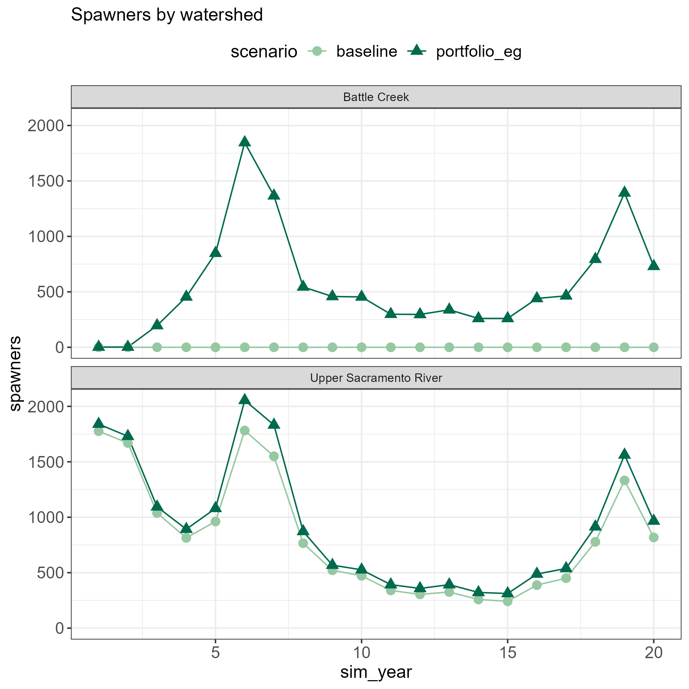
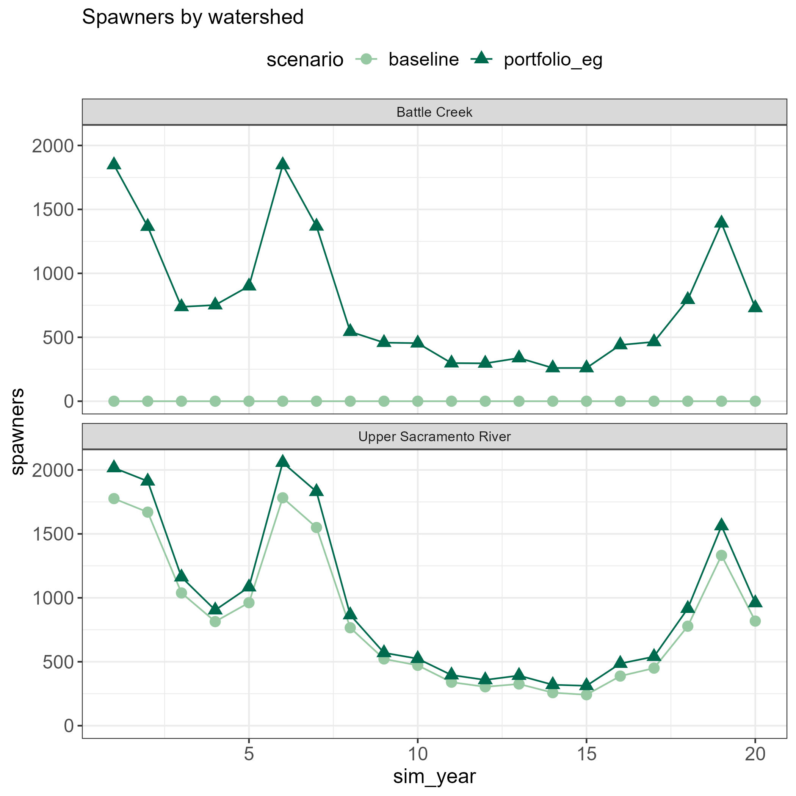

## Description of included actions

-   **H-1: LSNFH modified release practices:** Release hatchery-reared salmon in locations or at times that differ from traditional practices to improve survival and support population recovery. This may include releasing fish at different life stages, in alternative river reaches, or under specific environmental conditions to reduce predation, improve imprinting, and enhance ocean survival.
-   **H-2: LSNFH facility upgrades and production improvements:** Combines all proposed hatchery upgrades and production improvements, and will be reflected by bookend estimates (high and low) of changes. Major upgrades and improvements reflected include a pathogenic filtration system to allow reintroduction of WRCS above Shasta to spawn, brood fish collection facility (e.g., in-river pound net) on the Sacramento River to collect natural origin fish and maintain fitness wtihin the integrated (hatchery-natural) WRCS population, addition of a secondary trapping location, upgrades to the Keswick Fish Trap, installation of permanent water chiller to provide the hatchery with cold water during drought years, and electrical and plumbing upgrades.
    -   **H-2a: LSNFH facility and adult collection upgrades**
    -   **H-2b: Upgrades to Keswick Dam adult collection system**
-   **H-3: CNFH trapping and sorting improvements:** Non-water supply improvements, including construction of an automated fish sorting and trapping facilitie to allow for daily real-time sorting that can reduce excess holding/handling and migration delays for WRCS and passage blockage, and improvements to water treatment infrastructure.
-   **SR-4a: Reduce predation on Sacramento River:** Implement projects to minimize predation at weirs, diversions, and related structures in the Sacramento River.
-   **SR-11: Captive rearing and assisted migration of juveniles in drought years:** Provide a temporary refuge for a portion of natural-origin juveniles in years when conditions are predicted to be poor and release them back into the wild. From Sep-Nov, capture 10k juvenile WRCS (expandable to 100k fish over time) at USFWS’s Red Bluff Diversion Dam rotary screw traps, transport fish to a contained, protected (from predators) and productive off-channel rearing environment (e.g. artificial floodplain, or net pen). When mean fish size is 90mm or by March (whichever comes first), collect fish from the rearing environment. Apply fin clips and coded wire tags to all fish (PBT won’t work because parents are unknown). Transfer fish into a boat equipped with continuously recirculating river water. Over 5-7 days transport fish from Red Bluff to Horseshoe Bay (near GG Bridge). Fish will be fed natural prey while in transport (cultured dipterans, cladocerans or similar). Fish will be continuously bathed in ambient waters with a clear view of the sky (for imprinting and orientation). Upon arrival at Horseshoe Bay, fish will be transferred into a net pen for \~24 hours prior to release. Release will occur on a strong outgoing tide at night. NOTE: When migratory conditions are favorable, some or all of refuge rearing WRCS could be released into the Sacramento River rather than being transported (with imprinting) for downstream release.
-   **O-2: Increase distance from shoreline to "International" designation:** If the distance from shoreline of the International designation is increases, there could be less fish extracted from the ocean.
-   **BC-1: Control illegal harvest and/or poaching in Battle Creek:** Fund an increased level of effort for agencies to reduce the potential for illegal harvest and poaching
-   **BC-8: Battle Creek egg incubation:** Place fertilized eggs directly into natural streambed habitats within Battle Creek. This method allows eggs to develop in a more natural environment, improving imprinting and potentially increasing survival rates compared to traditional hatchery rearing.

```{r setup, include=FALSE}
knitr::opts_chunk$set(echo = FALSE, warning = FALSE, message = FALSE)
```

```{r message = FALSE, warning = FALSE}
library(winterRunDSM)
library(tidyverse)
library(plotly)
library(ggplot2)
library(zoo)
library(kableExtra)
library(knitr)
library(here)

theme_plots <- 
  theme_bw() + 
  theme(axis.text = element_text(size = 12),
        axis.title = element_text(size = 13),
        legend.text = element_text(size = 12),
        legend.title = element_text(size = 13),
        legend.position = "top")

colors <- c("#93c47d", "#009E73")
colors2 <- c("goldenrod", "#D55E00")

# Formats summary table with commas and decimals
format_metric <- function(x) {
  dplyr::case_when(
    is.na(x)        ~ "NA",
    abs(x) >= 1000  ~ formatC(x, format = "f", digits = 0, big.mark = ","),
    abs(x) >= 2   ~ formatC(x, format = "f", digits = 0),
    abs(x) >= 1     ~ formatC(x, format = "f", digits = 2),
    abs(x) > 0      ~ formatC(x, format = "f", digits = 3),
    TRUE            ~ formatC(x, format = "f", digits = 0)
  )
}
```

```{r}
obj_metrics <- read_csv(here("wr_sdm/documentation/objectives_metrics.csv"))
source("calculate_performance_metrics_scen_intro.R")
```

```{r}
kbl(summary_metrics_table, booktabs = T) |> 
  kable_styling() |> 
  row_spec(c(5,9,13,18), extra_css = "border-bottom: 3px solid black;") 
```

## A note about seeds

The model spins up using several years of data (years 1-6) to seed the model before producing results for year 1. This allows the model to produce more results for the limited time series. For the portfolio, this seeding period takes into account the actions in the portfolio. Thus you can see differences between the baseline and portfolio starting in simulation year 1.

```{r}
#| fig-cap: "Spawner results using baseline scenario seeds (does not include portfolio actions)"
#| out-width: "80%"
#| fig-align: center

```

```{r}
#| fig-cap: "Spawner results using portfolio scenario seeds (includes portfolio actions)"
#| out-width: "80%"
#| fig-align: center

```


## Abundance

### Spawners

```{r, out.width = '100%'}
(spawner_plot <- ggplot(spawners_split) + 
  geom_line(aes(sim_year, spawners, color = scenario)) +
  geom_point(aes(sim_year, spawners, color = scenario, shape = scenario), size = 3) +
    labs(title = "Spawners by watershed")+
    facet_wrap(~watershed, nrow = 2) + 
  scale_color_manual(values = colors)+
  theme_plots)
```

```{r, out.width = '100%'}
ggplot(spawners) + 
  geom_line(aes(sim_year, spawners, color = scenario)) +
  geom_point(aes(sim_year, spawners, color = scenario, shape = scenario), size = 3) +
    labs(title = "Spawners across watersheds")+
  scale_color_manual(values = colors)+
  theme_plots
```

```{r}
kbl(summary_metrics_table |> filter(Metric == "Mean spawners"))
```

### Natural origin WR returning to spawn

Natural origin spawners - each year and tributary has a different proportion natural based on hatchery allocations in previous years. Total combines applicable watersheds.

```{r, echo = FALSE, out.width = '100%'}
ggplot(returns) +
  geom_line(aes(sim_year, nat_returns, color = scenario)) +
  geom_point(aes(sim_year, nat_returns, color = scenario, shape = scenario), size = 3) +
  labs(title = "Natural Origin Returning Adults", y = "Natural Origin Spawners") +
  # facet_wrap(~watershed, nrow = 2) + 
  scale_color_manual(values = colors)+
  theme_plots
```

```{r}
kbl(summary_metrics_table |> filter(Metric == "Mean natural spawners"))
```

### Hatchery origin WR returning to spawn

Hatchery origin spawners - each year has a different proportion natural based on hatchery allocations in previous years. Total combines applicable watersheds.

```{r, echo = FALSE, out.width = '100%'}
ggplot(returns) +
  geom_line(aes(sim_year, hatchery_returns, color = scenario)) +
  geom_point(aes(sim_year, hatchery_returns, color = scenario, shape = scenario), size = 3) +
  labs(title = "Hatchery Origin Returning Adults", y = "Hatchery Spawners") +
  # facet_wrap(~watershed, nrow = 2) + 
  scale_color_manual(values = colors2)+
  theme_plots
```

```{r}
kbl(summary_metrics_table |> filter(Metric == "Mean hatchery spawners"))
```

### Frequency of population decline

Number of years of decline in spawners.

```{r}
kbl(summary_metrics_table |> filter(Metric == "Years of declining spawners"))
```

### Frequency of catastrophic decline

Maximum 3-year average change in spawners across model time series.

```{r}
kbl(summary_metrics_table |> filter(Metric == "Catastrophic decline"))
```

## Productivity

### Number of juveniles emigrating from upper Sacramento River

Number of juveniles originating from the Upper Sacramento River watershed. Numbers shown are juveniles before they undergo rearing, growth, migration, etc.

```{r}
ggplot(juvs_us) +
  geom_line(aes(year, total_juv, color = scenario)) +
  geom_point(aes(year, total_juv, color = scenario, shape = scenario), size = 3) +
  labs(title = "Juveniles in Upper Sac", y = "Juveniles in Upper Sac") +
  scale_color_manual(values = colors)+
  theme_plots
```

```{r}
kbl(summary_metrics_table |> filter(Metric == "Mean juveniles outmigrating from Upper Sac"))
```

### Number of natural origin smolts surviving to reach the ocean

This metric calculates natural-origin juveniles at Chipps, showing only "large" and "very large" size classes to represent smolts. We apply proportion of natural-origin juveniles to integers to obtain the result.

```{r, out.width = '100%'}
ggplot(nat_juv_at_chipps) + 
  geom_line(aes(year, nat_jac, color = scenario)) +
  geom_point(aes(year, nat_jac, color = scenario, shape = scenario), size = 3) +
  labs(title = "Natural-origin Smolts at Chipps", y = "Smolts at Chipps") +
  scale_color_manual(values = colors)+
  theme_plots
```

```{r}
kbl(summary_metrics_table |> filter(Metric == "Mean natural smolts at ocean entry"))
```

### Cohort Replacement Rate

Battle Creek does not have a baseline value for this performance metric.

```{r, out.width = '100%'}
ggplot(crr) + 
  geom_line(aes(sim_year, crr, color = scenario)) +
  geom_point(aes(sim_year, crr, color = scenario, shape = scenario), size = 3) +
  geom_hline(yintercept = 1, linetype = "dashed") + 
  labs(title = "Cohort Replacement Rate", y = "Cohort Replacement Rate") +
  facet_wrap(~watershed, nrow = 2) + 
  scale_color_manual(values = colors)+
  theme_plots
```

```{r}
kbl(summary_metrics_table |> filter(Metric == "Mean CRR"))
```

## Life history diversity and fitness

### pHOS

```{r, out.width = '100%'}
ggplot(phos) + 
  geom_line(aes(sim_year, phos, color = scenario)) +
  geom_point(aes(sim_year, phos, color = scenario, shape = scenario), size = 3) +
  scale_color_manual(values = colors2)+
  labs(title = "pHOS",y = "pHOS") +
  facet_wrap(~watershed, nrow = 2) + 
  theme_plots
```

```{r}
kbl(summary_metrics_table |> filter(Metric == "Mean pHOS"))
```

### Size class diversity

We show two plots: one shows the Shannon Diversity Index calculated for size class, and one shows the proportions per year. The Shannon Diversity Index measures evenness and diversity: a higher value indicates greater evenness and diversity, while a low number may indicate domination by one group (in this case, very large individuals in the portfolio scenario).

```{r, out.width = '100%'}

ggplot(shannon_di_size) + 
  geom_line(aes(year, shannon_index, color = scenario)) +
  geom_point(aes(year, shannon_index, color = scenario, shape = scenario), size = 3) +
  labs(title = "Size Class Diversity", y = "Diversity Index")+
  scale_color_manual(values = colors)+
  theme_plots
```

```{r, out.width = '100%'}
ggplot(juvenile_size_ocean_entry)+
  geom_col(aes(year, value, fill = factor(size_or_age)), position = "fill", color = "black") +
  labs(y = "proportion of juveniles", title = "Size Diversity") +
  facet_wrap(~scenario, nrow = 2) + 
  viridis::scale_fill_viridis(option= "mako", discrete = TRUE)  + 
  theme_bw()
```

```{r}
kbl(summary_metrics_table |> filter(Metric == "Mean juvenile size diversity at ocean entry"))
```

### Timing diversity

We show two plots: one shows the Shannon Diversity Index calculated for month of entry, and one shows the proportions per year. The Shannon Diversity Index measures evenness and diversity: a higher value indicates greater evenness and diversity, while a low number may indicate domination by one group (month of ocean entry).

```{r, out.width = '100%'}
ggplot(shannon_di_timing) + 
geom_line(aes(year, shannon_index, color = scenario)) +
geom_point(aes(year, shannon_index, color = scenario, shape = scenario), size = 3) +
labs(title = "Timing Diversity", y = "Diversity Index")+
scale_color_manual(values = colors)+
theme_plots
```

```{r, out.width = '100%'}
ggplot(juvenile_month_ocean_entry)+
  geom_col(aes(year, value, fill = factor(month)), position = "fill", color = "black") +
  labs(y = "proportion of juveniles", title = "Timing Diversity") +
  facet_wrap(~scenario, nrow = 2) + 
  viridis::scale_fill_viridis(option= "turbo", discrete = TRUE)  + 
  theme_bw()
```

```{r}
kbl(summary_metrics_table |> filter(Metric == "Mean juvenile timing diversity at ocean entry"))
```

## Increase number of tributaries supporting WR

### Number of adults spawning in tributaries

Results shown for Battle Creek.

```{r}
ggplot(spawners_in_tribs) + 
  geom_line(aes(sim_year, spawners, color = scenario)) +
  geom_point(aes(sim_year, spawners, color = scenario, shape = scenario), size = 3) +
  labs(title = "Spawners in Battle Creek", y = "Spawners in Battle Creek")+
  scale_color_manual(values = colors)+
  theme_plots
```

```{r}
kbl(summary_metrics_table |> filter(Metric == "Mean spawners in tributaries"))
```

### Number of juveniles rearing in tributaries

This shows the number of juveniles present in a tributary before they grow, rear, and migrate.

```{r, out.width = '100%'}
ggplot(juvs_trib) +
  geom_line(aes(year, total_juv, color = scenario)) +
  geom_point(aes(year, total_juv, color = scenario, shape = scenario), size = 3) +
  labs(title = "Juveniles in Battle Creek", y = "Juveniles in Battle Creek") +
  scale_color_manual(values = colors)+
  theme_plots
```

```{r}
kbl(summary_metrics_table |> filter(Metric == "Mean juveniles in tributaries"))
```

### Number of independent populations

Independent populations, also named viable populations, include those with:

* greater than 500 spawners
* pHOS less than 5%
* CRR > 1
* Growth rate (spawner change) > 1

We sum up the number of populations (tributaries) that meet the criteria for the 3 last years of the time series.

```{r, out.width = '100%'}
ggplot(ind_pop_long) + 
  geom_tile(aes(sim_year, metric, fill = factor(value)), color = "black")+
  facet_grid(watershed~scenario) +
  scale_fill_manual(values = c("maroon", "lightblue"))
```

```{r}
kbl(summary_metrics_table |> filter(Metric == "Number of independent pops"))
```

### Number of independent populations in historic habitats

This PM is not relevant for this portfolio since Battle Creek is the only tributary included. Historic habitats include Pit River, Little Sacramento River, and McCloud River.

```{r}
kbl(summary_metrics_table |> filter(Metric == "Number of independent pops in historic habitat"))
```

### Number of dependent populations

Defined as populations not meeting independent population criteria. 

```{r}
kbl(summary_metrics_table |> filter(Metric == "Number of dependent pops"))
```
